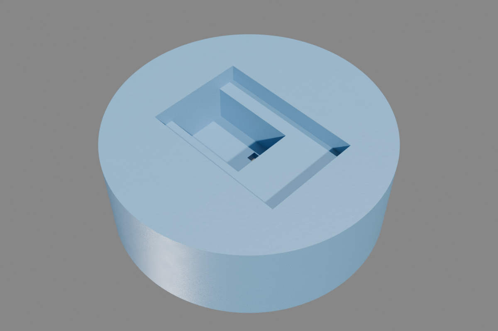
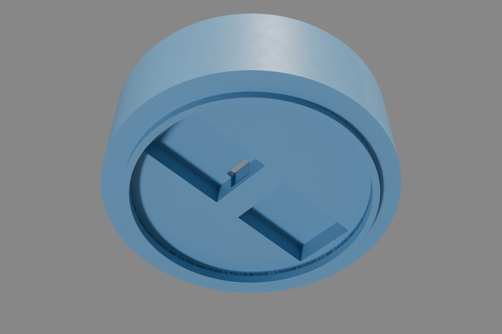
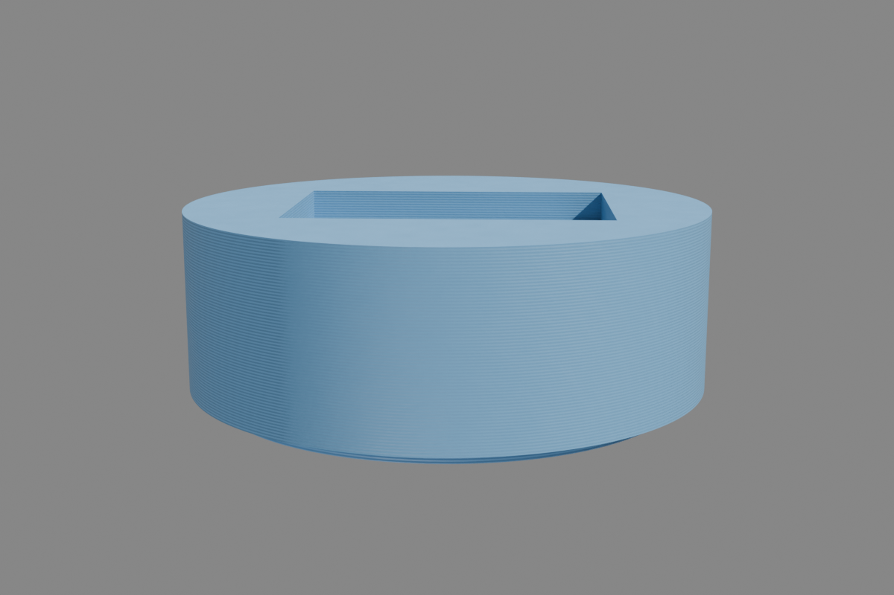

# Smart Sourdough Lid

A 3D-printed smart lid for a Weck 580ml jar that monitors sourdough starter rise, temperature, humidity, and pressure — reporting to Home Assistant via ESPHome.

## Bill of Materials

| Component | Part | Note |
|---|---|---|
| Controller & Display | M5Stack Core Ink | ESP32 + 1.54" e-ink display + 390mAh battery |
| Env Sensor | M5Stack ENV III Unit | SHT30 (temp/hum) + QMP6988 (pressure), Grove |
| Distance Sensor | M5Stack VL53L0X Unit | Time-of-flight, Grove |
| Hub | M5Stack 1-to-3 HUB Expansion Unit | Splits one Grove port into three |
| Enclosure | 3D Printed Lid (single piece) | PETG recommended, see `lid/sourdough-lid.scad` |

No screws or additional hardware needed.

## Wiring

All sensors are I2C over Grove cables through the HUB.

```
Core Ink Grove port
       |
       |  Grove cable
       v
  +----------+
  | 1-to-3   |
  |   HUB    |
  +--+---+---+
     |   |   +--- port 3: free (future expansion)
     |   |
     |   +-------- port 2: Grove cable -> ENV III
     |
     +------------ port 1: Grove cable -> VL53L0X
```

| Connection | I2C Address |
|---|---|
| Core Ink Grove -> HUB -> ENV III (SHT30) | 0x44 |
| Core Ink Grove -> HUB -> ENV III (QMP6988) | 0x70 |
| Core Ink Grove -> HUB -> VL53L0X | 0x29 |

Grove uses GPIO32 (SDA) / GPIO33 (SCL) on the Core Ink.

## 3D Printed Enclosure

The lid is a single monolithic piece — a parametric OpenSCAD model in `lid/sourdough-lid.scad`.

| Top (component pockets) | Bottom (sensor recesses) | Side profile |
|---|---|---|
|  |  |  |

- **Top side**: Separate pockets for M5Stack Core Ink (display up) and 1-to-3 HUB, connected by a cable channel with Grove connector clearance
- **Bottom side**: Flat 100mm disc that replaces the glass Weck lid. VL53L0X and ENV III sensors are recessed flush into the bottom surface with snap tabs (leaving the Grove port side clear for cables)
- **Cable routing**: Through-base cable channels with Grove connector clearance connect the bottom sensor pockets to the top side
- **Rim**: 3mm clip ledge around the disc edge for the Weck metal clips

### Print settings

- Material: PETG (food-adjacent, heat resistant)
- Layer height: 0.2mm
- Infill: 20%
- Supports: none needed
- Orientation: right-side up (flat bottom on print bed)

### Rendering

Toggle between `print_orientation()` (print-ready) and `assembled()` (visualization with ghost components) in the render selector near the top of the `.scad` file. All dimensions are parametric — measure your jar with calipers and adjust `lid_od` and `jar_id`.

```bash
# Export STL for slicing
openscad -o lid/sourdough-lid.stl lid/sourdough-lid.scad
```

## Assembly

1. Slide **VL53L0X** into the center pocket on the bottom (snaps in, aperture faces into the jar)
2. Slide **ENV III** into the offset pocket on the bottom (snaps in)
3. Route Grove cables up through the **cable channels** to the top side
4. Place the lid on the jar with the **rubber gasket**, clip the two **Weck metal clips** onto the rim
5. Plug both sensor cables into the **1-to-3 HUB**, plug the HUB into the **Core Ink** Grove port
6. Drop the **Core Ink** (display up) and **HUB** into the top pockets (retaining lips keep Core Ink in place)

## Rise Tracking & Peak Detection

The lid tracks sourdough starter activity over time and detects when the starter is at peak strength — the optimal moment to use it.

### How it works

1. **Press "Feed Sourdough"** in Home Assistant (or on the HA dashboard) after feeding your starter — this captures the baseline distance to the dough surface
2. The VL53L0X ToF sensor measures distance to the dough every 60 seconds
3. **Rise %** is calculated from how much the dough has risen relative to its initial height
4. **Rise rate** (mm/min, smoothed over 5 readings) shows how fast the starter is growing
5. **Peak detection** fires when the starter begins falling back after rising at least 10mm — this is when it was strongest

### Entities in Home Assistant

| Entity | Type | Description |
|---|---|---|
| Sourdough Temperature | sensor | °C from SHT30 |
| Sourdough Humidity | sensor | %RH from SHT30 |
| Sourdough Pressure | sensor | hPa from QMP6988 |
| Sourdough Distance | sensor | mm from VL53L0X to dough surface (readings >2000mm filtered as invalid) |
| Sourdough Rise | sensor | Rise % since last feed |
| Sourdough Rise Rate | sensor | mm/min, 5-reading moving average |
| Sourdough Peaked | binary_sensor | Turns on when starter passes peak |
| Battery Voltage | sensor | V from ADC on GPIO35 (×2 voltage divider) |
| Battery Percent | sensor | Estimated % (3.0–4.2V range) |
| Feed Sourdough | button | Resets baseline for a new feeding cycle |
| Jar Depth | number | mm from sensor to jar bottom (measure and set once) |

### Home Assistant automation example

```yaml
automation:
  - alias: "Sourdough peaked notification"
    trigger:
      - platform: state
        entity_id: binary_sensor.sourdough_peaked
        to: "on"
    action:
      - service: notify.mobile_app_your_phone
        data:
          title: "Sourdough Ready!"
          message: "Your starter has peaked at {{ states('sensor.sourdough_rise') }}% rise."
```

### Setup

1. Flash the firmware (see below)
2. In Home Assistant, set **Jar Depth** to the distance in mm from the ToF sensor face to the bottom of your jar (measure with a ruler)
3. After feeding your starter, press **Feed Sourdough** to begin tracking

## ESPHome Configuration

See [`sourdough-lid.yaml`](sourdough-lid.yaml) for the full configuration.

### Sensor notes

- **ENV III** contains two chips: `sht3xd` (temp + humidity) and `qmp6988` (pressure) — each needs its own sensor block.
- **Display** uses `waveshare_epaper` platform with model `1.54inv2`. SPI is on Core Ink's internal pins (CLK=GPIO18, MOSI=GPIO23); CS=GPIO9, DC=GPIO15, BUSY=GPIO4, RST=GPIO16. Battery percentage is shown in the header; pressing the top button forces a sensor refresh.
- **Battery** is read via ADC on GPIO35 through a ×2 voltage divider. The percentage is a linear map from 3.0V (empty) to 4.2V (full).

### Flashing

```bash
# Validate config
esphome config sourdough-lid.yaml

# Compile + flash over USB (first time)
esphome run sourdough-lid.yaml

# OTA update (after initial flash)
esphome run sourdough-lid.yaml --device sourdough-lid.local
```
